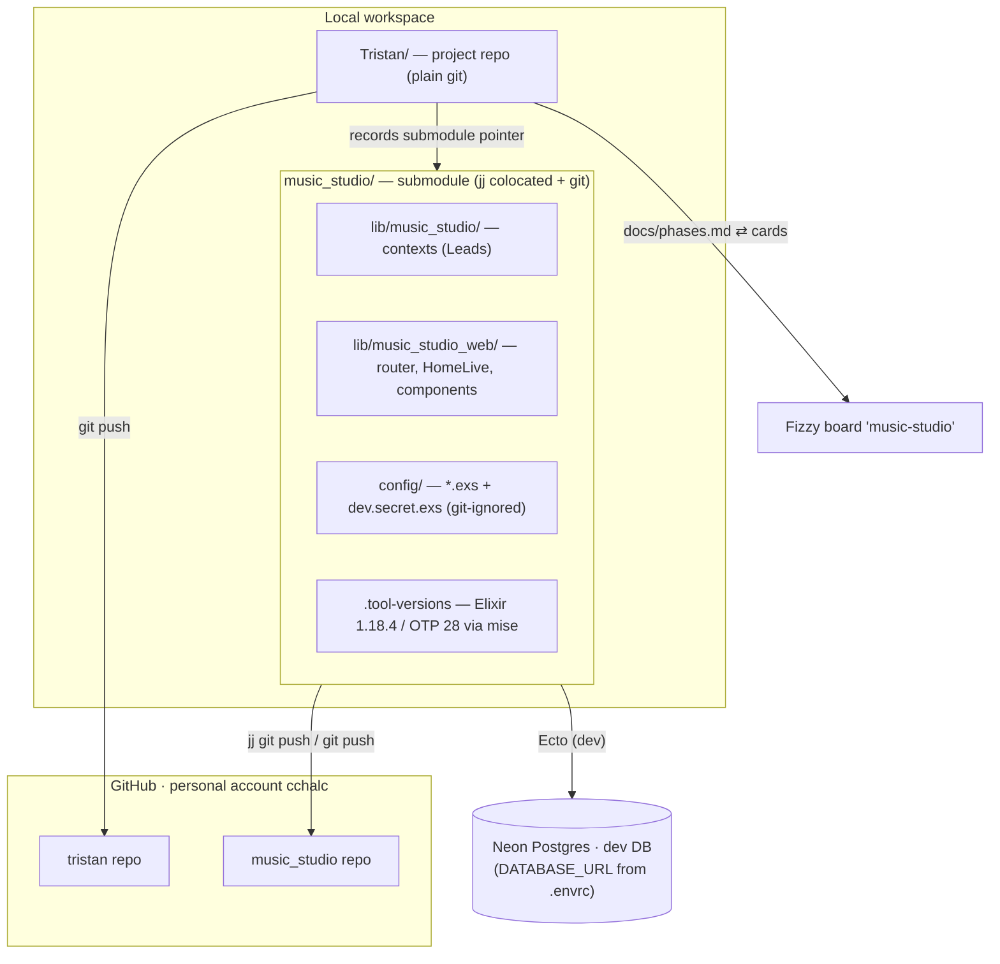
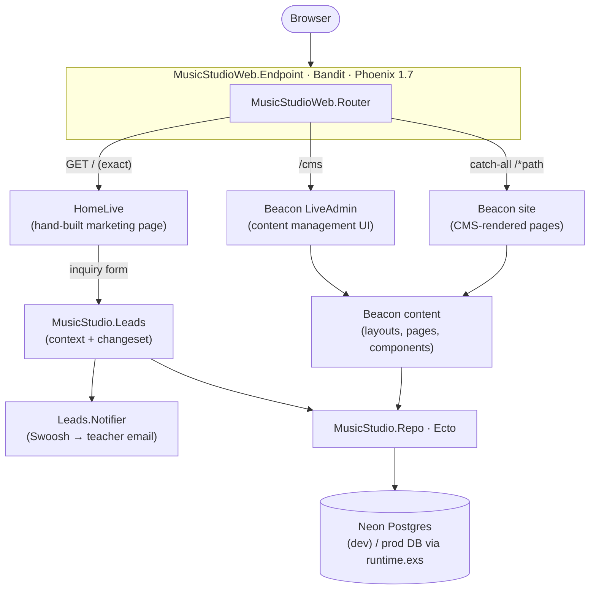

# Architecture: project level vs app level

## The question this answers

Where should configuration and code live — at the "project level" or the "repo
level"? In a plain Phoenix app those are the same thing (one repo == one project).
This workspace deliberately separates them so the application stays **isolated** and
**portable**, with room to add sibling projects (e.g. analytics) without interference.

## Workspace topology

## Runtime architecture (the app)

The app is Phoenix **1.7** + LiveView **1.2** on **Bandit**, with **Beacon CMS** mounted
alongside a hand-built LiveView. Everything persists through one Ecto repo, which points
at **Neon** in dev.

**The pieces and how they connect:**

| Piece | Where | Role |
|---|---|---|
| Project repo | `Tristan/` (plain git) → `cchalc/tristan` | Planning, docs, and a **submodule pointer** to the app; tracked to Fizzy. |
| App repo | `music_studio/` (jj + git) → `cchalc/music_studio` | The Phoenix app; a submodule of `Tristan`. Publish with `jj git push`. |
| Endpoint / Router | `lib/music_studio_web/{endpoint,router}.ex` | Bandit HTTP; routes `/` → HomeLive, `/cms` → Beacon admin, `/*` → Beacon site (catch-all, last). |
| HomeLive | `lib/music_studio_web/live/home_live.ex` | Hand-built single-page marketing site + inquiry form; currently owns exact `/`. |
| Beacon CMS | dep `beacon` + `beacon_live_admin` (site `:music_studio`) | DB-backed pages/layouts/components; admin at `/cms`; serves non-`/` paths. Custom `MusicStudioWeb.BeaconRuntimeCSS`. |
| Leads context | `lib/music_studio/leads*` | Validates + persists inquiries; `Leads.Notifier` emails the teacher (Swoosh). |
| Design system | `assets/css/app.css` | Radix "Modern Minimal" tokens + `ms-` classes; Tailwind v4 + daisyUI. |
| Repo / DB | `MusicStudio.Repo` → **Neon** (dev) / prod DB | One Ecto repo backs both Leads and Beacon; dev URL from `.envrc` (direnv), prod from env in `runtime.exs`. |
| Toolchain | `.tool-versions`, mise | Elixir 1.18.4 / OTP 28; **Phoenix pinned `~> 1.7`** (Beacon 0.5.1 needs a pre-1.8 Phoenix API — see `../lessons.md`). |
| Tracking | Fizzy board + GitHub issues | Phases ↔ Fizzy cards; dev/debug ↔ issues on `cchalc/music_studio`. |

Session continuity lives in the project repo's living docs (`checkpoint.md`, `tasks.md`,
`lessons.md`) — see `../CLAUDE.md` for the working protocol. A full review of what was
specified vs. delivered is in [`specifications-review.md`](specifications-review.md).

## Two altitudes

### Project level — the `Tristan` repo
Cross-cutting concerns that are *about the project*, not any one application:

- Roadmap and phasing (`docs/phases.md`)
- Architecture and decisions (`docs/architecture.md`)
- Work tracking (Fizzy board, GitHub issues)
- Pointers to each application (as submodules)

No application code lives here.

### App level — the `music_studio` submodule (its own repo)
Everything tied to a running application lives inside that application's own repo:

- Phoenix contexts / business logic (`lib/music_studio/…`)
- Config split: committed `config/*.exs` vs local `config/dev.secret.exs`
  (git-ignored) vs production env vars in `config/runtime.exs`
- Its own agent config: `.claude/skills`, `AGENTS.md`, `mix precommit` gate
- Its own toolchain pin (`.tool-versions`, mise)

Because the app is its own repo, the standard Phoenix conventions apply unchanged
*inside* it, and it can be cloned, deployed, or handed off on its own.

## Why a submodule (not a monorepo folder or loose siblings)

- **Isolation:** separate git history and CI per application; the app doesn't inherit
  or pollute project-level history.
- **Linked, not detached:** the project repo records a specific app commit, so the
  workspace always points at a known-good revision — unlike loosely-referenced
  sibling repos.
- **Clean expansion:** a future analytics project becomes a second submodule beside
  `music_studio`. They share the workspace but never interfere.

Trade-off: submodules add a little ceremony (`git submodule update`, committing the
pointer when the app advances). See `../AGENTS.md` → "Submodule basics".

## Config layering inside an app (reference)

| Layer | Where | Committed? | Use |
|---|---|---|---|
| Compile-time, all envs | `config/config.exs` | yes | non-secret defaults |
| Per-env | `config/{dev,test,prod}.exs` | yes | env-specific, non-secret |
| Local dev secrets | `config/dev.secret.exs` | **no** (git-ignored) | local API keys |
| Local dev template | `config/dev.secret.example.exs` | yes | shows the shape |
| Runtime / prod secrets | `config/runtime.exs` via `System.get_env/1` | yes (reads env) | production secrets |

External SaaS integrations (billing, email, analytics — later phases) are wired as
secrets in these layers plus a thin in-app context, never hard-coded.
