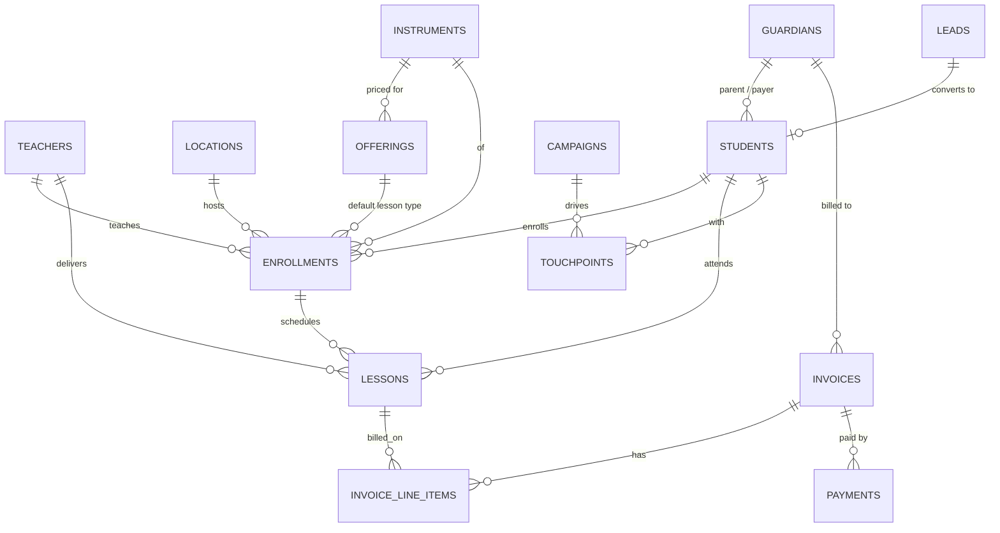

# Data model — music_studio

_Last updated: 2026-08-31._

A well-defined, analytics-ready domain model for the music-teaching business. It lives in
**Postgres (Neon)** today and is deliberately shaped to feed an eventual **lakehouse**
(Databricks/Delta) with minimal rework. **Ecto owns the modeling logic** — schemas,
changesets, and context modules; there is no admin UI for these entities yet.

## Design principles

- **Normalized OLTP source-of-truth + hybrid marts.** The tables are a clean, normalized
  system of record. A couple of SQL **views** provide BI-shaped convenience now; proper
  dimensional (star) modeling is deferred to the lakehouse.
- **UUIDv7 keys** on all new tables (via the `uuidv7` Ecto type in `MusicStudio.Schema`) —
  globally unique and time-sortable, so rows merge cleanly across systems and keep good
  index locality. The legacy `leads` table keeps its bigint key.
- **CDC-friendly conventions** so incremental extraction into the lakehouse is trivial:
  `inserted_at`/`updated_at` (`:utc_datetime_usec`) as a high-watermark; **soft delete**
  (`deleted_at`) instead of hard deletes so history survives; `Ecto.Enum` stored as
  **strings**; money as integer `*_cents` + `currency` (CAD); `jsonb` `metadata` for
  flexible attributes; an **append-only `events`** stream as the behavioral fact source.
- **Generic reference tables** (teachers, locations, instruments, offerings) — multi-teacher
  / multi-location ready even though the studio is one teacher today.

## Entity relationships

## Table catalog

Contexts map to `lib/music_studio/<context>.ex` (+ schema files under `<context>/`).

| Context | Table | Purpose |
|---|---|---|
| `Catalog` | teachers | The teacher(s). Seeded: Tristan. |
| `Catalog` | locations | Where lessons happen (`in_person`\|`online`). Seeded: the studio. |
| `Catalog` | instruments | Subjects taught. Seeded: voice, piano, guitar. |
| `Catalog` | offerings | Rate card — duration + price (`60/$60`, `45/$45`, `30/$30` CAD). |
| `Teaching` | guardians | Parent/payer for a student. |
| `Teaching` | students | A student; may link to a `guardian` and originate from a `lead`. |
| `Teaching` | enrollments | Ongoing student↔instrument↔teacher relationship. |
| `Teaching` | lessons | **Core fact** — a single session; status carries attendance; price snapshot. |
| `Billing` | invoices | A bill to a guardian/student. |
| `Billing` | invoice_line_items | Lines on an invoice, optionally tied to a lesson/offering. |
| `Billing` | payments | Payments against invoices (`cash`\|`e_transfer`\|`card`\|`other`). |
| `Leads` | leads | Public inquiries (bigint, pre-existing). Extended with funnel fields: `status`, `source`, `converted_student_id`. |
| `CRM` | campaigns | Marketing campaigns. |
| `CRM` | touchpoints | CRM interactions with a lead or student. |
| `Analytics` | events | **Append-only** activity stream (actor/verb/subject/metadata). Immutable. |

### Reporting views (hybrid marts)

- **`analytics_lesson_facts`** — one row per lesson, flattened with student/teacher/
  instrument/offering names, price, and status. The grain a BI tool wants.
- **`analytics_funnel`** — lead → student conversion counts by source/status/instrument.

Read via `MusicStudio.Analytics.lesson_facts/0` and `funnel/0`.

## Notable modeling choices

- **`leads` stays bigint.** It predates this model and powers the live contact form; FKs
  from `students.lead_id` and `touchpoints.lead_id` are bigint, while `leads.converted_student_id`
  points forward to a UUIDv7 `students` row. The funnel is linkable both directions.
- **Attendance is a lesson status** (`scheduled|completed|cancelled|no_show|rescheduled`)
  rather than a separate table — simpler for OLTP, easy to pivot in analytics.
- **`last_name` is optional** on students (single-name leads convert cleanly);
  `first_name` is required.
- **Lead conversion** (`MusicStudio.CRM.convert_lead_to_student/2`) is transactional:
  it creates the student (carrying `lead_id`) and marks the lead `converted` atomically.

## Path to the lakehouse

The Postgres model is the **bronze source**. Because every mutable table carries
`updated_at` + `deleted_at` and stable UUIDv7 keys, ingestion into Delta is straightforward:

1. **Bronze** — land raw table snapshots/CDC. Incremental pulls filter on `updated_at`;
   `deleted_at` propagates deletes without losing history (soft-delete = SCD-friendly).
   The `events` stream lands append-only (no updates to reconcile).
2. **Silver** — clean/conform: enums are already portable strings, money is integer cents,
   `metadata` jsonb maps to a struct/variant. Join reference tables into dimensions.
3. **Gold** — dimensional marts: `dim_student`, `dim_teacher`, `dim_offering`,
   `fact_lesson` (from `lessons`), `fact_payment` (from `payments`), `fact_event`
   (from `events`). The `analytics_*` Postgres views prototype these grains today and can
   be retired once the gold layer exists.

Nothing in the app depends on the lakehouse; this is purely about keeping the OLTP schema
ingestion-ready so that step is low-friction when it happens.

## See also

- [`architecture.md`](architecture.md) — runtime + workspace architecture.
- [`specifications-review.md`](specifications-review.md) — specified vs. delivered.
